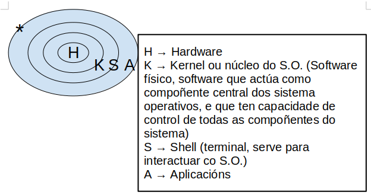

= Comandos ISO

* *pwd:* En qué directorio estamos posicionados.
* *clear:* Limpia pantalla.
* *exit:* Salir de la terminal.
* *history:* muestra el historial de comandos.
** *history -c:* borra el historial de comandos.

* *id:* Toda la información sobre nuestra cuenta: grupos, nombres y números.

[EXAMPLE]
====
usuario=número_de_grupo(nombre_de_grupo)
====

* *id -nu:* Nombre de usuario; el parámetro (los parámetros van con guión) nu es "name user", y puede ir en diferente orden *-un*.

* *id -u:* Número de usuario.

* *id -g:* Número de grupo principal.

* *id -gn:* Nombre del grupo principal.

* *groups:* Nos muestra todos los grupos a los que pertenece el usuario actual.

* *uname:* muestra información sobre el sistema operativo. 

* *uname:* Nombre del sistema (Unix NAME). Se suele utilizar con parámetros, es raro usarlo solo.
- *-n:* Nodo. Es el nombre del PC. 
- *-o:* Nombre completo del Sistema Operativo.
- *-p:* Procesador. Muestra la arquitectura del procesador, p.ej: x86_64.
- *-r:* Release; versión del kernell, núcleo, del SO.
- *-a:* muestra todo (all). Muestra el nombre del kernell (Linux), el nombre del host, la versión del kernell, la arquitectura del hardware y la fecha y hora de compilación del kernell.

* *date:* nos muestra la fecha/hora.
** *date | tee fichero.ext:*  mostrará la fecha y la hora actual en la pantalla y, al mismo tiempo, guardará esa información en un archivo llamado "fichero.ext".

* *bc:* Entras a la calculadora. 
- Ctrl+D (^D) para salir.

* *man:* Manual del sistema. Va seguido del comando del que quieres saber la ayuda.
- Por ejemplo, *man date:* Ayuda del comando date.

* *info:* Información. Se basa en el man, pero suele ser más entendible. Es indistinto usar uno u otro, donde se encuentre mejor. Suele dar más ejemplos el info.
Al igual que _man_, se usa seguido de un comando:
- Por ejemplo, *info date:*

[NOTE]
Para salir, tanto de _man_ como de _info_, hay que pulsar la _q_ de _quit_.

* *whatis [...]:* Nos dice para qué sirve un parámetro, por ejemplo: *whatis pwd*.

* *echo [...]:* emite el mensaje que le pongas por pantalla.
___

* *ls:* (listar), nos muestra el contenido de donde estamos. Tiene una serie de colores (en Ubuntu al menos).
- *-a:* Nos muestra los ficheros y directorios, incluídos ocultos.
- *.:* Nos muestra lo del directorio actual, es lo mismo que no poner nada.
- *..:* Nos muestra lo que hay en el directorio padre.
- *-A:* lista los archivos y directorios en un directorio, excluyendo los directorios especiales " . " (punto) y " .. " (punto-punto). Estos dos directorios son referencias al directorio actual y al directorio padre, respectivamente, y se omiten en la salida cuando se utiliza ls -A. Muestra también los ocultos. Vamos, resumiendo, muestra lo mismo que el *ls -a* pero sin las referencias al directorio padre y el directorio actual.
    

- *-l:* Listado largo, tiene la mayoría de la información que estamos buscando: nombre, tamaño de la carpeta, hora y fecha de creación... Y el tipo de fichero que es (la d es de directorio, el . un fichero oculto, la _ un fichero ordinario...) y los permisos (rwx), quién es el propietario del fichero y cuál es el grupo primario (el grupo que sale es el grupo principal que era en el momento de la creación).

[NOTE]
    El CHAR al principio del directorio en el *ls -l* hace referencia al tipo de archivo:
        
        d → directorio

        - → fichero ordinario

        l → link

        c → CHAR

        b →ficheros por bloque

        p → pipe

        s → socket

- *-1:* La lista la quiero en una columna; no existe el -2 xD. Obviamente si lo combinas con -l no hace falta porque ya lo saca en una columna. Carece de sentido.
* *ls -d /ruta/al/directorio:* El comando mostrará el nombre del directorio _/ruta/al/directorio_ en lugar de listar los archivos y subdirectorios que contiene.
- *ls /:* En este caso nos muestra lo que hay en la raíz del sistema; se puede poner otro sitio en vez de _/_, por ejemplo *ls /home -l*.
- *-M*:* Que liste todo lo que empiece por M. Si buscamos directorios hay que hacer el siguiente comando.
- *-d M*:* Especifica que buscas un directorio la _-d_. Con la -d te muestra tanto directorios como archivos, con 
- *ls -ld M\*:* > Musica.vacio: Te crea el directorio que le pones detrás del _>_
- *ls -ld \*ca*:* Que muestre lo que empiece como sea, que contenga ca, y que acabe como sea, como si no hay nada más del _ca_.
- *ls -ld \*s > termina.s:* No lo mostrará por pantalla, porque le estás cambiando la salida al archivo que le mandas crear después del _>_.
- *ls -[DdEe]\*:* lista los elementos que empiecen con D, d, E o e. En el ejemplo se pone tanto minúscula como mayúscula porque discrimina estas.
- ls -d [{CHAR}-{CHAR}]*: lista elementos que empiecen por los CHAR(S) dentro de un rango. Es sensible a mayúsculas y minúsculas.
     
    ▪ Ejemplo: ls -d [A - E] → Buscará todo lo que contenga desde una “A” hasta una “E”
    
    ▪ Ejemplo: ls -d [A - EI]* → Buscará todo lo que acaba con una “A” hasta una “E” o acabe en una “I”

[NOTE]
Los parámetros se pueden combinar; por ejemplo: *ls -la*

[NOTE]
La ruta y el parámetro pueden ir uno delante del otro indistintamente: *ls .. -l* = *ls -l ..*

* *ls -ld \*[CHAR(S)-CHAR(S)]\*:* busca elementos que contengan caracteres de un rango determinado.
** Ejemplo: ls -ld *[0-9]*: busca elementos que contengan un caracter en el rango entre corchetes ambos inclusive → lista todos los elementos que contengan 0, 1, 2, 3, 4, 5, 6, 7, 8 y/o 9, independientemente de donde estén los números en el nombre del elemento.

    • ls -ld [*][.][?]: lista los elementos que después de un punto tengan determinado número de caracteres, determinados por el número de <?>.

    • ls -ld [!{CHAR(S)}]: lista los elementos que NO empiecen por determinado caracter.

    • ls -ld {CHAR(S)}?*: lista elementos que después del caracter contiene determinado número de caracteres, determinados por el número de <?>.
            ▪ Ejemplo: ls -ld *f*[0-9]*: lista los elementos que contengan un <f> y después, un número de 0 a 9, ambos inclusive.

Para concatenar comandos, utilizaremos [;]
    • Por ejemplo: date; pwd; ls > informe.txt ejecuta los tres comandos juntos, seguidos y de manera independiente, pero solo redirige el último como salida a un fichero, y mostrando el resultado de todo
    • Ejemplo 2: (date; pwd; ls) > informe.txt ejecuta los tres comandos de forma simultánea y redirige la salida de los tres juntos a un fichero.
	
Redireccionamiento:
    • < redirecciona la entrada
    • > redirecciona la salida hacia un archivo, si este existe, lo sobreescribirá, si no existe, lo creará.
    • >> redirecciona la salida, pero no sobreescribirá el archivo existente, sino que se añadirá al fichero al final. En caso de no existir el fichero, lo creará.
La mayoría de estos se usan para editar ficheros con cat
 
Comando tee:
    • redirecciona la salida a un fichero y luego lo muestra por pantalla
        ◦ tee - a fichero.extensión: redirecciona la salida, muestra por pantalla y añade contenido al fichero
            ▪ Ejemplo: date | tee -a informe.txt crea el informe.txt y le añade información resultante del comando date

    • ls -r: hace un listado en orden alfabético inverso (Z-A)

    • ls -lR <directorio>: ver todo el directorio y su contenido 	
        ◦ R (de 🔁 recursividad) 
    • ls -R : Registra todos los directorios de la raíz. Los ordena en orden alfabético
        ◦ 2> /dev/null: redirige la salida y descarta aquellos a los que no puede acceder, considerándolos como errores y la salida va a /dev/null, es decir, la “papelera”
        ◦ ls -lR / 2> /dev/null: hace un listado recursivo del directorio raíz (root), e indica que en caso de error, redirige a una salida
    • ls -id: muestra el inodo de un elemento
        ◦ para listar el inodo de los elementos dentro de un directorio, utilizamos los comodines
            ▪ ejemplo: ls -id *

El inodo o i-nodo es un identificador único de un archivo o directorio, y es irrepetible. La única manera de que se repita es utilizando un enlace

Visualizar
    • cat + {nombre.fichero}: visualiza contenidos de un fichero (solo muestra el contenido)
        ◦ para crear un fichero, de manera interactiva, redireccionamos la salida del comando a un nuevo	fichero
            ▪ Ejemplo: cat > ejemplo.txt → Después Ctrl + D para terminar
    • cat -n: enumera las líneas de un fichero
            ▪ Si nuestro fichero contiene los números rojo, azul y blanco uno en cada línea, visualizamos 1	rojo, etc…
        ◦ cat {fichero1} {fichero2} >> {fichero3}: une dos ficheros, uno añadido al final del otro

    • tac: visualizar un fichero en orden inverso.
            ▪ Si nuestro fichero contiene los números 1, 2 y 3, uno en cada línea, visualizamos 3, 2 y 1.

    • history: muestra un historial de los comandos utilizados hasta el momento
        ◦ history -c: elimina todas las entradas del historial
        ◦ history {NUMERO}: muestra los últimos comandos del historial, el número de entradas es el establecido por el {NUMERO}
            ▪ Ejemplo: history 10: muestra los 10 últimos comandos utilizados

    • !{NÚMERO}: vuelve a realizar el comando con este número en el historial (comando history)

    • more: permite visualizar un fichero como listado largo, permitiendo saltar líneas o páginas enteras.

    • more +{NUMERO} fichero.extensión: muestra el fichero a partir de determinada línea en adelante
            ▪ el número de líneas que va a “saltar” se define sustituyendo el {NUMERO}.

    • <comando> | more: para paginar un listado.
            ▪ Ejemplo: history | more: muestra el listado del historial de comandos en forma paginada.
        ◦ Al pulsar [intro] vamos a una línea más abajo y  al pulsar [espacio] nos movemos una página entera, Para salir pulsamos [Q]

    • less: permite visualizar un fichero paginado pudiendo ir hacia delante o hacia atrás en las páginas.

    • <comando> | less: para paginar un listado. Permite movernos hacia atrás.

* *cat nombre.fichero:* Visualizamos el contenido de un fichero ordinario.
* *cat > nombre.fichero:* Crear un fichero de forma interactiva; le vas a poner datos y los va guardando en el fichero; cuando quieras acabar, Ctrl+D.

[NOTE]
AQUÍ FALTAN LOS COMANDOS DEL JUEVES Y VIERNES ÚLTIMOS DE SEPTIEMBRE.

* *ls -l d-uno:* mostrar el contendio del directorio d_uno-
* *ls -l d_uno/d_dos:* mostrar el contenido de d_dos.

* *ls -R / 2>/dev/null:* QUe haga un listado recursivo desde la raíz (/)el 1 es para que muestre por pantalla, no es necesario porque lo pone por defecto. Pero el 2 es de error, y lo de null es papelera, para que se deshaga del error y lo mande a la papelera. Buscar mejor este comando porque está explicado raro aquí. Si quiero hacer un listado recursivo a partir del directorio actual, vale con no ponerle nada, o sino: *ls -R . 2>/dev/null*; y si quieres desde la raíz *ls -R / 2>/dev/null*

Va entrando en todos los subdirectorios desde la raíz y diciéndote qué hay en cada uno.

* *ls -r:* la r minúscula es de reverse, y va a ir de la Z a la A. 

[NOTE]
No confundir -R con -r, la primera es recursividad, la segunda es reverse, de la A a la Z-

* *rmdir d_tres:* Borra el directorio d3 pero tiene que estar vacío. Dará fallo si tiene contenido.

* *rm -r d_uno:* elimina el directorio aunque tenga contenido. Aquí la -r es remove, no reverse. 

* *cat -n colores.txt:* el - n enumera las líneas del archivo.

* *more colores.txt:* nos permite ver un fichero por dentro a partir de cierta línea; por ejemplo, *more +3* muestra a partir de la línea 3, esta incluída.

* *less colores.txt:* probarlo, va igual que el more pero al revés o algo así.

* *ls -1 / | more +3:* vemos el listado a partir de la línea 3.

* *cp colores.txt color.txt:* copiar un archivo _colores.txt_ y guardarlo con el nombre _color.txt_.

* *cp colores.txt cinco/:* que haga una copiar de colores.txt en el directorio cinco/ (cp origen destino); la "/" es opcional, va a entender que es un directorio aunque no se la pongas

* *mv colores.txt lista.color.txt:* renombrar el archivo colores.txt a lista.color.txt. Con mover no generas nada, simplemente cambias el nombre del fichero. *mv* también renombra directorios: *mv seis dire:*

* *mv planetas.txt dire/:* mv también sirve para mover, aquí está moviendo el archivo planetas.txt al directorio dire/.

* *mv color.txt siete/color.siete.txt:* no solo lo mueve, sino que lo renombra a la vez.

* *mv *.txt ..:* cuando usemos comodines como mover todo lo que termine en .txt, puede dar problemas, sobre todo si en vez de en el origen como en el ejemplo, usamos el comodín en el destino. Verificar siempre con _ls_. Por ejemplo, si quiero coger todos los ficheros .txt y renombrarlos a .doc (*mv *.txt *.doc*) nos va a dar error, se piensa que *.doc es un directorio

* *cp ~{c1.txt,c2.txt,lscolor.txt} .:* le estamos pidiendo que con una ruta absoluta vaya a homre, y coja los tres ficheros que hay entre llaves y los copie aquí (.) OJO NO PONER ESPACIOS DESPUÉS DE LAS COMAS.

* *cp ../c1.txt ../c2.txt ../COLOR.txt ocho/:* es lo mismo, que copie los fichero del directorio padre (vamos, realmente el archivo está en el directorio donde estamos xd) y los copie a ocho/. Las rutas de origen pueden ser todas las que quieras, la que tenga cada archivo que quieres copiar, pero el destino tiene que ser el mismo para todos, solo puede ser uno.

* *touch:* crea fichero vacío; puede crear varios a la vez: *touch iso.txt fol.txt bases.txt*; si quiero crearlos en diferentes rutas, se especifica en cada fichero: *touch ../xbd.txt /../apuntes/fundamentos.adoc*.

* *mkdir -p facturacion/compras/{C_2020, C_2021}*: sin la _-p_ daría error, porque es la que especifica que primero cree el directorio padre que ya y luego entre llaves pones los directorios hijos que son los que crea.

* *touch facturacion/compras/C_2020/{ene_2020.txt,feb_2020.txt,mazo_2020.txt}:* crear tres archivo a la vez en un directorio (destino{ficheros}); ojo a no poner espacio después de las comas.

